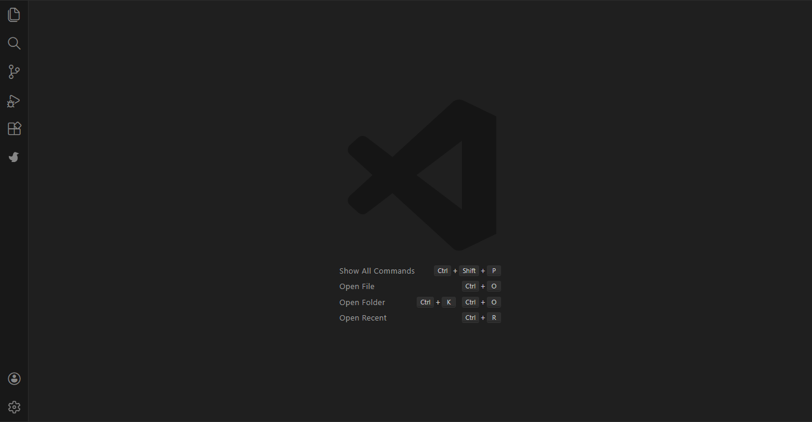

<div align="center">
  <sub>
    <a href="README.md">English</a> | <a href="README.es.md">Español</a> | 简体中文
  </sub>
</div>

<h1 align="center">
  Blu - 为您缺失的工具注入动力
</h1>

<p align="center">
  <a href="https://github.com/GarvAgnihotri/blu">
    
  </a>
  <a href="https://github.com/GarvAgnihotri/blu/issues">
    
  </a>
  <a href="https://github.com/GarvAgnihotri/blu/blob/main/LICENSE">
    
  </a>
  <a href="https://marketplace.visualstudio.com/items?itemName=Garv.blu">
    
  </a>
  <a href="https://marketplace.visualstudio.com/items?itemName=Garv.blu">
    
  </a>
  
</p>

<div align="center">
  <table>
    <tbody>
      <td align="center">
        <a href="https://marketplace.visualstudio.com/items?itemName=Garv.blu" target="_blank"><strong>在 VS Marketplace 下载</strong></a>
      </td>
      <td align="center">
        <a href="https://github.com/GarvAgnihotri/blu/discussions" target="_blank"><strong>功能请求</strong></a>
      </td>
    </tbody>
  </table>
</div>

---

<p align="center">
  
</p>

## 什么是 Blu？

**Blu** 是一款由 AI 驱动的 VS Code 扩展，帮助您从**目标而非提示**出发进行工作。描述您想要实现的目标，Blu 将分析您的代码库，规划必要的更改，并逐步执行——始终需要您的批准。

Blu 建立在强大的 Cline 基础之上，通过增强的目标导向工作流程和专注于开发者协作的理念扩展了这一概念。

---

## 主要功能

### 目标驱动开发

**从意图而非实现出发工作。** 只需描述您的目标——“添加用户身份验证”、“重构此组件”或“修复移动端布局”——Blu 将在进行任何更改之前创建详细计划。

- **智能任务分解**：Blu 分析您的请求并将其分解为逻辑步骤
- **上下文感知规划**：了解您的项目结构和依赖关系
- **批准工作流程**：在执行前审查并批准每个步骤

> [!TIP]
> 在侧边栏中打开 Blu（查看 → 命令面板 → "Blu: Open Sidebar"）以与您的代码并行工作。这使您可以完全了解 Blu 的规划和执行过程。

<!-- Clear float -->
<div style="clear: both;"></div>

### 深度代码库理解

Blu 不仅读取文件——它理解您的项目。通过 AST 分析、依赖映射和语义搜索，Blu 能够快速上手，即使在大型复杂代码库中也是如此。

- **AST 解析**：理解代码结构和关系
- **智能上下文管理**：仅添加相关文件到上下文
- **模式识别**：识别常见模式和最佳实践
- **跨文件感知**：理解更改如何影响整个代码库

<!-- Clear float -->
<div style="clear: both;"></div>

### 人在回路执行

**您始终掌控全局。** Blu 在做出任何更改之前会呈现清晰的计划并显示差异。在 Blu 处理您的任务时，批准、修改或拒绝每个步骤。

- **交互式差异视图**：准确查看将更改的内容
- **逐步批准**：控制执行节奏
- **实时反馈**：在 Blu 工作时提供输入
- **撤销/重做**：对每次修改的完全控制

<!-- Clear float -->
<div style="clear: both;"></div>

### 强大工具集成

#### 文件创建与编辑
Blu 可以创建新文件、修改现有文件，甚至跨多个文件进行重构，同时保持代码质量和一致性。

#### 终端集成
直接在终端中执行命令，并完全监控输出。Blu 可以：
- 安装依赖项并运行构建脚本
- 启动开发服务器
- 运行测试和迁移
- 部署应用程序

#### 浏览器自动化
对于 Web 开发任务，Blu 可以：
- 在浏览器中启动您的应用程序
- 与 UI 元素交互
- 捕获屏幕截图和控制台日志
- 调试视觉和运行时问题

### 多模型支持

使用您偏好的 AI 提供商：
- **OpenAI**
- **Anthropic**
- **Google Gemini**
- **OpenRouter**
- **以及更多**

成本跟踪和令牌使用监控帮助您保持在预算内。

<!-- Clear float -->
<div style="clear: both;"></div>

### 通过 MCP 扩展

使用**模型上下文协议**扩展 Blu 的功能。为您的特定工作流程创建自定义工具：

- **"添加获取 Jira 票证的工具"** – 直接从需求出发工作
- **"添加检查 AWS 状态的工具"** – 监控基础设施
- **"添加查询数据库的工具"** – 获取真实数据洞察
- **"添加与 API 集成的工具"** – 连接内部服务

Blu 甚至可以自动帮助您创建和安装这些工具。

<!-- Clear float -->
<div style="clear: both;"></div>

### 上下文感知辅助

使用简单命令添加上下文：

- **`@ 添加上下文`** – 包含特定文件的内容

输入以搜索并快速添加 Blu 理解您的任务所需的内容。

<!-- Clear float -->
<div style="clear: both;"></div>

### 检查点与版本控制

**安全地进行实验。** Blu 在工作时创建检查点，允许您：
- **比较**任何检查点与当前状态
- **恢复**到之前的时间点
- **分支**不同的方法
- **合并**成功的实验

所有更改都在 VS Code 的时间线中跟踪，便于回滚。

<!-- Clear float -->
<div style="clear: both;"></div>

---

## 快速开始

### 快速安装
1. **从 VS Code Marketplace 安装**：搜索"Blu"或使用[此直接链接](https://marketplace.visualstudio.com/items?itemName=Garv.blu)
2. **打开 Blu**：点击活动栏中的 Blu 图标，或从命令面板运行 `Blu: Open Sidebar`
3. **配置您的 AI 提供商**：在设置中添加您的 API 密钥（Ctrl+, → 扩展 → Blu）
4. **开始您的第一个任务**：输入一个目标，让 Blu 规划执行

---

## 架构与理念

Blu 建立在三个核心原则之上：

1. **清晰第一** – 没有隐藏的更改，没有魔法。一切都是透明且可解释的。
2. **开发者控制** – 您批准每个更改。Blu 建议，您决定。
3. **协作智能** – Blu 增强您的能力，不取代您的判断。

### Blu 如何工作
1. **目标分析** – 理解您的意图和需求
2. **上下文收集** – 分析代码库的相关部分
3. **计划生成** – 创建逐步执行计划
4. **交互执行** – 在您批准下执行每个步骤
5. **验证** – 测试并验证结果

---

## 贡献

我们欢迎贡献！以下是开始的方式：

1. **分叉仓库**并在本地克隆
2. **设置开发环境**：
   ```bash
   npm install
   npm run compile
